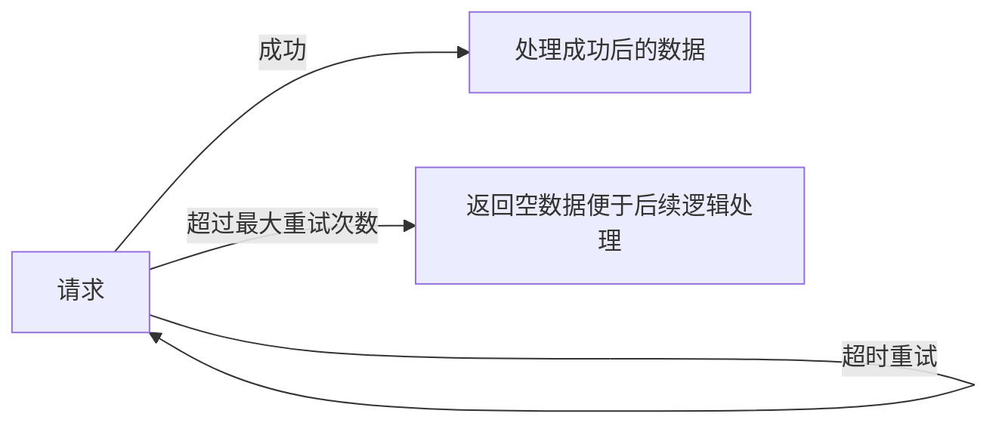

## 从requests请求重试到万能重试装饰器
重试，在编写代码的过程中，是一个很常见的需求。
比如：
1. 请求重试（例如：超时）
2. 文件占用
3. IO阻塞等待

那么，我们如何编写重试的代码呢？
本文将从请求重试开始，带大家从简单的超时重试，最后编写到万能错误重试。
> 主要涉及内容：
>- requests adapter
>- 函数装饰器
>- 类装饰器

话不多说，start！

**因为我们需要从 `requests` 请求重试开始，为了方便测试请求，我们用 `flask` 编写一个简单的服务器，用于请求测试。**

准备请求服务器
----
服务器的功能比较简单，用来查看请求次数和观察是否重试成功，`flask_server.py`代码如下：
```python
from time import sleep

from flask import Flask, jsonify, Response

app: Flask = Flask(__name__)

retry_count: int = 0  # 用于重试请求的计数


@app.route("/api/retry", methods=["GET"])
def retry_api() -> Response:
    """
    延时 1s 的请求接口， 响应时间 > 1s。
    :return:
    """
    global retry_count
    retry_count += 1
    print(f"这是第{retry_count}次请求")
    if retry_count < 3:
        sleep(1)
    else:
	    retry_count = 0  # 计数清零
    return jsonify({"msg": "已经三次了哦！"})


if __name__ == '__main__':
    app.run()

```
代码比较简单，由于没有找到好用的`flask`上下文来完成计数需求，这里为了简单操作，就直接应用了全局变量来计数（仅用于测试，未加锁），而没有使用`redis`数据库来计数了。

编写好之后，我们运行代码即可。这样，我们用来测试重试的服务器就准备好了。

接下来，我们先来看看一般的 `requests` 超时请求如何实现。

1.`requests` 请求重试（常见版本）
---
我们用 `try...except...` 语句捕捉`timeout`错误。进行循环重试即可。我们编写一个函数 `get_data`，`normal.py`代码如下：
```python
from typing import Dict, Any

import requests

BaseDictData = Dict[str, Any]


def get_data(url: str, max_retry: int = 0, time_out: float = 3., **kwargs) -> BaseDictData:
    """自动重试 timeout 错误 的方法"""
    params: BaseDictData = kwargs.get("params", {})  # 不管你传了什么奇怪的东西， 我只收这个
    headers: BaseDictData = kwargs.get("headers", {})  # 同上
    for i in range(max_retry + 1):
        """进行最大重试次数的遍历"""
        try:
            response: requests.Response = requests.get(
                url=url,
                params=params,
                headers=headers,
                timeout=time_out,
            )
        except requests.ReadTimeout:
            print(f"第{i + 1}次请求失败，正在重试。")
        else:
            return response.json()  # 没有错误，直接返回

    print(f"{max_retry + 1} 次请求都失败了，返回空值，便于后续逻辑处理。。。")
    return {}


if __name__ == '__main__':
    print(get_data("http://localhost:5000/api/retry", max_retry=1, time_out=.01))

```
在该函数中，我们利用 `requests` 库本身的 `timeout` 参数进行错误捕捉。整体比较简单，设计逻辑即：


如果超时，那么就会引发错误，然后继续请求，用`for`循环来处理循环重试，更加简洁。

超过最大次数，就返回空数据，成功，返回成功数据。

代码段注意要点：
**`try...except...`** 语句 
```python
try:
	...  # 需要捕捉异常的代码
except xxx:
	...  # 发生异常处理逻辑
else:
	...  # 如果 try 成功执行，就执行else，否则跳过else
finally:
	...  # 一定会执行该语句块
```
我们在 `try` 语句块中只运行了一行代码，因为这次捕捉只针对这行代码可能会引起的错误，做到**精确捕捉异常**。

如果 `try` 语句块中的代码太多的话（比如要做多件事情），错误调试和错误处理都比较麻烦，因为我们不知道是哪行引起的错误，需要加（`print`） 或者 （`debug`）来查看具体错误原因，并且不要担心使用`try...except...`语句，`python`中的异常处理代价是很小的，异常处理也是很常见的。


而`else`语句块，就是正常逻辑的补充处理。

**TIPS:**
**在 `for...in...:`语句中也有`else`语句块，对完成循环后进行补充。**
<details>
  <summary><code>for...in...</code>示例</summary>  

比如，我们要循环检测一个列表`check_data: List[Union[int, str]] = [1, 2, 3, 4]`是否有字符串，如果有字符串我们就不进行后续处理，如过没有字符串，我们就调用 `handle_data` 函数。 

为了满足上面的需求，通常，我们都会写一个 `tag/signal`来标注状态，例如下面的代码：
```python
has_string: bool = False
for data in check_data:
	if isinstance(data, str):
		has_string = True
		break
		
if not has_string:
	# 没有字符串的情况下
	handle_data() 
```
有了 `else` 我们就可以简化代码，如下：
```python
for data in check_data:
	if isinstance(data, str):
		break
else:
	# 没有字符串的情况下
	handle_data() 
```
这样逻辑就可以更清晰一些。另外， `while 循环`也支持 `else` 语句，这里就不重复演示了。

</details>


#### 查看效果。
我们调用 ` print(get_data("http://localhost:5000/api/retry", max_retry=2, time_out=.01))`
客户端结果:
```
第1次请求失败，正在重试。
第2次请求失败，正在重试。
{'msg': '已经三次了哦！'}
```

服务端结果：
```
这是第1次请求
这是第2次请求
这是第3次请求
```
这里 `max_retry` 为最大**重试**次数，所以最大请求次数为`1+max_retry`。

我们调用`print(get_data("http://localhost:5000/api/retry", max_retry=1, time_out=.01))`
客户端结果:
```
第1次请求失败，正在重试。
第2次请求失败，正在重试。
2 次请求都失败了，返回空值，便于后续逻辑处理。。。
{}
```

服务端结果：
```
这是第1次请求
这是第2次请求
```
可以看出，整体效果也是符合预期的，没有多大问题。
接下来，我们利用`requests`自带的请求重试器。

## 2. `requests adapter` 重试
`requests` 有一个 `HTTPAdapter` 对象，看名字就有一种可以给 `requests`加特效的感觉。

不过 `HTTPAdapter` 主要可以实现：
>创建连接池，（类似线程池，进程池，连接可服用）
>限定连接池数量（避免连接数过多（线程过多））。
>重试请求。

`requests_built.py`代码如下：
```python
import requests
from requests.adapters import HTTPAdapter

from normal import BaseDictData


def get_data(url: str, max_retry: int = 0, time_out: float = 1., **kwargs) -> BaseDictData:
    """
    自动重试 timeout 错误 的方法, 用 requests 自带轮子完成！
    :param url: 请求的 url
    :param max_retry: 最大重试次数
    :param time_out: 超时重试时间
    :param kwargs: 可选命名参数
    :return: BaseDictData
    """
    session: requests.Session = kwargs.get("session", requests.Session())  # 获取session 或者新建 session
    params: BaseDictData = kwargs.get("params", {})  # 不管你传了什么奇怪的东西， 我只收这个
    headers: BaseDictData = kwargs.get("headers", {})  # 同上
    adapter: HTTPAdapter = HTTPAdapter(max_retries=max_retry)  # 初始自带处理额外操作的适配器
    session.mount("http://127.0.0.1", adapter=adapter)  # 给我们的 session 安装上 adapter, 第一个参数为主机，代表对于哪台主机的请求需要装上适配器
    try:
        response: requests.Response = session.get(
            url,
            params=params,
            headers=headers,
            timeout=time_out
        )
    except requests.ConnectTimeout:
        print(f"{max_retry + 1}次请求都失败了，即将返回空值，请耐心等待...")
    else:
        session.close()  # 关闭 session, 源码主要是清除所有装配器
        return response.json()
    return {}


if __name__ == '__main__':
    res = get_data("http://127.0.0.1:5000/api/retry", 3)
    print(res)
```
整体代码也比较简单，在常规请求之上，主要加了两行代码。就是给 `Session` 对象用 `mount` 方法给对于 `http://127.0.0.1`的主机请求加上了 `adapter`，该`adapter`对象增加了最大的重试次数。

PS：
- 我们也可以用 `http://` 来表示对于所有`http请求`的主机都装上`adapter`
- 我们也可以针对多个请求主机
```python
session.mount("http://127.0.0.1", adapter=adapter)
session.mount("https://github.com", adapter=adapter)
```
运行结果（服务器端相似，之后的展示只展示客户端）:

`print(get_data("http://127.0.0.1:5000/api/retry", 2))`

客户端：
```
{'msg': '已经三次了哦！'}
```
`print(get_data("http://127.0.0.1:5000/api/retry", 1))`

客户端：
```
2次请求都失败了，即将返回空值，请耐心等待...
{}
```
## 3.构造请求重试装饰器
通过前两个方法来看，我们知道主要的重试方式有两种：
1. 循环请求
2. `requests`自带的适配器

但是呢，这两种，可复用性不太强，我们升级一下，用装饰器来试试。（当然，也有其他复用方法，比如创建重试专用对象，或者加入重试调度器）

当然装饰器的写法，我们至少也可以写出两种版本。

<details>
<summary>python装饰器原理速览</summary>

 <p>统计函数运行时间的装饰器<code>derector.py</code>：</p>
 
 ```python
import time


def count_fun_time(func):
    def wrapper(*arg, **kwargs):
        start_time = time.time()
        res = func(*arg, **kwargs)
        print(f"函数总共运行了{time.time() - start_time:.2f}s")
        return res
    return wrapper


def my_function(time_wait: int = 3):
    time.sleep(time_wait)
    print("运行结束")


my_function = count_fun_time(my_function)
my_function()
my_function(4)
 ```
 上面的代码示例为原始版本，就是利用函数的**闭包特性(闭包函数)**，在函数内部调用函数，同时进行其他操作即可。
 
然后将**新函数重新命名为原函数的名字**。
 
 运行结果如下：
 ```
 运行结束
函数总共运行了3.00s
运行结束
函数总共运行了4.00s
 ```
 当然，简便的python不会让你这样写，于是，语法糖变出现了。
 
 我们的计算运行时间的装饰器函数 `count_fun_time`不变，
 
 只需要在`my_funtion`上面加上糖`@count_fun_time` 即可。
 ```python
 @count_fun_time
 def my_function(time_wait: int = 3):
    time.sleep(time_wait)
    print("运行结束")
 
 my_function()
my_function(4)
 ```
 从上面的代码我们也可以，装饰器函数使用语法糖之后更加的**优雅和易懂。**
 
 但是在装饰器装饰元函数之后，元信息有所损坏(例如:`my_function.__name__`缺失)，需要进行改良（改良方法在下文中出现。）
 
</details>

### 3.1 构造被装饰的函数`get_data`
既然是装饰器，那么我们先定义一个**请求函数**，当作被装饰的函数。

代码如下：
```python
def get_data(url: str, time_out: float = 3., **kwargs) -> BaseDictData:
    """
    自动重试 timeout 错误 的方法, 用 requests 自带轮子完成！
    :param url: 请求的 url
    :param time_out: 超时重试时间
    :param kwargs: 可选命名参数
    :return: BaseDictData
    """
    session: requests.Session = kwargs.get("session", requests.Session())  # 获取session 或者新建 session
    params: BaseDictData = kwargs.get("params", {})  # 不管你传了什么奇怪的东西， 我只收这个
    headers: BaseDictData = kwargs.get("headers", {})  # 同上
    with session.get(url, params=params, headers=headers, timeout=time_out) as response:
        return response.json()
```

代码很简单，为了通用性（因为有两种装饰器，循环和`adapter`)，我们选择使用 `Session对象`来做请求。

好了，开始装饰器的正题。
### 3.1  循环重试装饰器
首先，我们先构思一下，我们的装饰器要完成什么。

`get_data` 这个函数为内部函数，可能`timeout`，我们复用之前写的错误即可，然后捕捉该错误。

接下来，如果运行函数出错，我们就进行循环重试。
#### 3.1.1 基本循环重试装饰器
整体代码如下：
```python
from functools import wraps

def retry(func):
    @wraps(func)  # 保留被装饰函数的元信息
    def closure(*args, **kwargs) -> BaseDictData:
        for i in range(3):
            try:
                res = func(*args, **kwargs)
            except (requests.ConnectTimeout, requests.ReadTimeout):
                print(f"第{i + 1}次重试。")
            else:
                return res
        return {}
    return closure

@retry
def get_data(...):
    --skip--
```
这里我们利用 `@wraps` 保留元函数信息。这样我们就可以看到完整的被装饰后函数的信息。例如:`get_data.__name__， 函数签名，函数文档等`。

运行结果类似，我们就不展示了，内容有点重复。
整体逻辑其实和`for...in...`循环的重试基本一致，但是我们封装成了一个装饰器函数，这样我们就可以到处用！简直不能太方便。
于此同时，我们可以看到 `except  (requests.ConnectTimeout, requests.ReadTimeout)` 这个地方！可以操作一下，假如错误类型是变量，那是不是就可以捕捉想捕捉的任意错误了。 并且，最大重试次数我们是写死的，这里肯定也能写成变量。那么，如何书写呢？

**再加一层闭包。** 没错，我们再套一层函数即可。
#### 3.1.2 任意错误循环重试的函数装饰器
`strong_retry`代码如下:
```python
def strong_retry(
        max_retry: int = 3,
        exception: Tuple[BaseException] = (
                requests.ConnectTimeout,
                requests.ReadTimeout,
        )
):
    """
    万能函数重试装饰器诞生！
    :param max_retry: 最大重试次数
    :param exception: 捕捉错误类型
    :return:
    """

    def retry(func):
        @wraps(func)  # 保留被装饰函数的元信息
        def closure(*args, **kwargs) -> BaseDictData:
            for i in range(max_retry + 1):
                try:
                    res = func(*args, **kwargs)
                except exception:
                    print(f"第{i + 1}次重试。")
                else:
                    return res
            return {}
        return closure
    return retry

@strong_common_retry(max_retry=4, exception=(requests.ReadTimeout,))
def get_data(...):
	# 装饰函数，最大重试数为 4，
```
再在外层函数帮助我们传入参数，并在原装饰器函数内部使用参数即可。

这样，我们就能针对**某些错误进行重试**操作了！（有一个模块 `retrying`, 也能进行错误重试，我们轻松的实现了一个简易版本！）
> 例如: 
> @strong_common_retry(exception=(ValueError, NameError))  # 针对这两个错误进行捕捉
> 但是有一点需要注意，千万不要用 `exception=(BaseException,)` !!!!这样连<kbd>Ctrl/Command</kbd> + <kbd>C</kbd> 都失效了！（引发`KeyboardInterrupt`错误的方法）

到这里完了吗？当然没有，因为我们还能再优化一下，当装饰器带有参数时，装饰器函数嵌套层数太多。影响阅读，这时候，祭出我们的装饰器神器`wrapt`。(需要 `pip install wrapt`)
使用后代码如下:
```python
def strong_common_retry(max_retry, exception):
    @wrapt.decorator  # 保留被装饰函数的元信息
    def wrapper(wrapped, instance, args, kwargs) -> BaseDictData:
        """
        
        :param wrapped: 
        :param instance:如果被装饰者为普通类方法，该值为类实例
                        如果被装饰者为 classmethod 类方法，该值为类
                        如果被装饰者为类/函数/静态方法，该值为 None 
        :param args: 
        :param kwargs: 
        :return: 
        """
        for i in range(max_retry + 1):
            try:
                res = wrapped(*args, **kwargs)
            except exception:
                print(f"第{i + 1}次重试。")
            else:
                return res
        return {}
    return wrapper
```
这样快速地就**减少了装饰器函数的嵌套层数**，同时还能解决对类中的函数装饰器绑定对象的问题。

所以当需要编写装饰器函数的时候，不妨试试`wrapt`吧！绝对是你的好帮手！

循环重试搞定了，函数装饰器也讲的差不多了，但是我们还有适配器装饰器没有讲，怎么办！当然换点花样，类的装饰器 **start**。

### 3.2 `Session`适配器重试
这次，我们的装饰器需要实现对原请求函数中的 `Session对象` 添加适配器，但是我们需要用类来实现。

但是类怎么实现呢？装饰器函数比较好理解，调用函数`func()`，我们就能完成原函数的替代。但是类怎么调用呢？ 这时候，就需要 python 给我们提供的魔术方法（双下方法）`__call__` 来实现了！

#### 3.2.1 类装饰器原理
其实`__call__`方法理解比较简单，就是可以让实例话的对象直接调用。Examples are as follows:
```python
class MySpider:
    def __call__(self):
        print(f"{self.__class__.__name__} is calling")


MySpider()()
```
输出结果如下：
`MySpider is calling`

这样我们就成功调用了实例化对象。

利用这个特性，我们就可以自然地写出装饰器类。
```python
class MySpider:
    def __init__(self, func: Callable):
        self.func = func

    def __call__(self, *args, **kwargs):
        print("reset for on second")
        time.sleep(1)
        res_data = self.func(*args, **kwargs)
        return res_data
        
    def at_once_run(self, *args, **kwargs):
        print("now, run the function")
        return self.func(*args, **kwargs)

def spider():
    print("正在抓取")

spider = MySpider(spider)
spider()
```
输出结果如下：
```
reset for on second
正在抓取
```
与装饰器函数很像，核心就是 `__call__` 方法。
那么类的装饰器有什么好处呢？
> 1. 没有复杂的函数嵌套，阅读代码时更加清晰，更加pythonic。
> 2. 可以增加许多额外的属性，更好的管理装饰器对象。
> 3. 可以给装饰器添加更多的功能。

功能怎么加呢？别忘了我们上个代码段还有一个函数没有使用！话不多说，直接看看怎么用。
原始用法：
```python
spider = MySpider(spider).at_once_run
spider()
```
但是看起来并不优雅，每次也比较麻烦。
语法糖用法：
```python
@MySpider
def spider():
	...
spider.at_once_run()
```
运行结果如下：
```
now, run the function
正在抓取
```
就像加了魔法一样，我们的原始函数`spider`变得异常强大，还增加了许多新的功能！

好了，把类当作装饰器的简单原理如上。接下来，我们就展示一下，用类装饰器为`Session`对象撞上翅膀！

#### 3.2.2 类装饰器实战
代码如下：
```python
class RequestsRetry:
    def __init__(self, max_retry: int, func: Callable) -> None:
        """需要注意。被装饰的函数是最后传入的。"""
        self.max_retry = max_retry
        functools.wraps(func)(self)  # 保留原函数的元信息
        self.func = func

    def __call__(self, *args, **kwargs) -> BaseDictData:
        """装饰器处理逻辑函数"""
        session: requests.Session = kwargs.get("session", requests.Session())  # 获取session 或者新建 session
        max_retry: requests.Session = kwargs.get("max_retry")  # 获取 max_retry
        adapter: HTTPAdapter = HTTPAdapter(max_retries=max_retry)  # 初始自带处理额外操作的适配器
        session.mount("http://", adapter=adapter)  # 给我们的 session 安装上 adapter, 第一个参数为前缀，代表哪种请求需要装上适配器
        kwargs.update(session=session)  # 更新 session， 如果没有传session，就将带适配器的 session 传入命名参数
        try:
            response: BaseDictData = self.func(*args, **kwargs)
        except requests.ConnectTimeout:
            print(f"{max_retry}次请求都超时了，即将返回空值，请耐心等待返回空值")
            return {}
        else:
            return response
            
    def itself(self, *args, **kwargs) -> BaseDictData:
        """不做处理，调用本身"""
        return self.func(*args, **kwargs)
        
    def __get__(self, instance, owner) -> object:
        """实现该方法后，可以将装饰器器用于类的函数的装饰。"""
        if instance is None:
            return self
        return types.MethodType(self, instance)  # 如果有参数，就绑定至self


def retry(max_retry: int = 3):
    """装饰器包装，增加请求重试参数。"""
    # 此处为了避免定义额外函数，直接使用 functools.partial 帮助构造 RequestsRetry 实例
    return functools.partial(RequestsRetry, max_retry)


@retry(max_retry=3)
def get_data(url: str, time_out: float = 3., **kwargs) -> BaseDictData:
	--skip--
```
`__init__`方法比较简单，接受了一个额外参数`max_retry`，然后利用`functools`保留**元函数信息**，和函数装饰器类似。
然后核心代码为`__call__`中的部分我们利用`kwargs`获取传入的`Session`对象，然后再将该对象加上**适配器**，然后还给`kwargs`，即可。这样就加上了最大重试次数，也就自带重试功能了。比`for...in...`更加简单，逻辑更加清晰，但是缺点就是只能针对`Session`对象的错误，不能针对万能错误进行重试。

最后`retry`函数，用了一个`partial`函数**辅助构造**（如果不实用该函数，为装饰器增加`max_retry`参数较为麻烦，此处不展开说明方法，感兴趣可以自己尝试，欢迎和我交流）类装饰器，顺便给装饰器换了个名字:)。

额外的东西：
> 我们为了保留元函数，增加了`itself`方法，该方法就是不增加额外功能的装饰器（**保持原函数逻辑调用**）。
> 有一个`__get__`方法，当实例化对象调用方法时，实质就会先调用该函数**获取绑定在实例化对象上的方法**。类的装饰器装饰其他类中的函数时，需要补上该方法，否则类中的函数不能使用装饰器。此处我们利用该方法，**重新构造绑定逻辑。**

输出结果和上文中的输出一致，这里就不重复展示结果了。
到这里，我们的所有重试方法就讲解完毕啦，相信你一定也收获满满。
老规矩，我们再总结一下本文所讲内容：
#### 总结
**1. `for...in...`循环实现`requests`请求重试
2. 利用`adapter` 实现`requests`请求重试
3. 装饰器函数原理
4. 利用函数装饰器实现`requests`请求重试到万能重试装饰器
5. 类装饰器简单原理
6. 类装饰器实战`requests`请求重试**

[完整代码地址](https://github.com/Dustyposa/goSpider/tree/master/python_advance/requests%E8%AF%B7%E6%B1%82%E9%87%8D%E8%AF%95)
