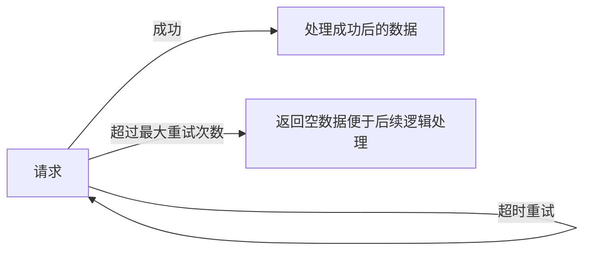

## 从requests请求重试到万能重试装饰器

重试，在编写代码的过程中，是一个很常见的需求。
比如：

1. 请求重试（例如：超时）
2. 文件占用
3. IO阻塞等待

那么，我们如何编写重试的代码呢？
本文将从请求重试开始，带大家从简单的超时重试，最后编写到万能错误重试。

> 主要涉及内容：
>
> - requests adapter
> - 函数装饰器
> - 类装饰器

话不多说，start！

**因为我们需要从 `requests` 请求重试开始，为了方便测试请求，我们用 `flask` 编写一个简单的服务器，用于请求。**

## 准备请求服务器

服务器的功能比较简单，用来查看请求次数和观察是否重试成功，`flask_server.py`代码如下：

```python
from time import sleep

from flask import Flask, jsonify, Response

app: Flask = Flask(__name__)

retry_count: int = 0  # 用于重试请求的计数


@app.route("/api/retry", methods=["GET"])
def retry_api() -> Response:
    """
    延时 1s 的请求接口， 响应时间 > 1s。
    :return:
    """
    global retry_count
    retry_count += 1
    print(f"这是第{retry_count}次请求")
    if retry_count < 3:
        sleep(1)
    retry_count = 0  # 计数清零
    return jsonify({"msg": "已经三次了哦！"})


if __name__ == '__main__':
    app.run()

```

代码比较简单，由于没有找到好用的`flask`上下文来完成计数需求，这里为了简单操作，就直接应用了全局变量来计数（仅用于测试，未加锁），而没有使用`redis`数据库来计数了。

编写好之后，我们运行代码即可。这样，我们用来测试重试的服务器就准备好了。

接下来，我们先来看看一般的 `requests` 超时请求如何实现。

## 1.`requests` 请求重试（常见版本）

我们用 `try...except...` 语句捕捉`timeout`错误。进行循环重试即可。我们编写一个函数 `get_data`，`normal.py`代码如下：

```python
from typing import Dict, Any

import requests

BaseDictData = Dict[str, Any]


def get_data(url: str, max_retry: int = 0, time_out: float = 3., **kwargs) -> BaseDictData:
    """自动重试 timeout 错误 的方法"""
    params: BaseDictData = kwargs.get("params", {})  # 不管你传了什么奇怪的东西， 我只收这个
    headers: BaseDictData = kwargs.get("headers", {})  # 同上
    for i in range(max_retry + 1):
        """进行最大重试次数的遍历"""
        try:
            response: requests.Response = requests.get(
                url=url,
                params=params,
                headers=headers,
                timeout=time_out,
            )
        except requests.ReadTimeout:
            print(f"第{i + 1}次请求失败，正在重试。")
        else:
            return response.json()  # 没有错误，直接返回

    print(f"{max_retry + 1} 次请求都失败了，返回空值，便于后续逻辑处理。。。")
    return {}


if __name__ == '__main__':
    print(get_data("http://localhost:5000/api/retry", max_retry=1, time_out=.01))

```

在该函数中，我们利用 `requests` 库本身的 `timeout` 参数进行错误捕捉。整体比较简单，设计逻辑即：



如果超时，那么就会引发错误，然后继续请求，用`for`循环来处理循环重试，更加简洁。

超过最大次数，就返回空数据，成功，返回成功数据。

代码段注意要点：
**`try...except...`** 语句 

```python
try:
	...  # 需要捕捉异常的代码
except xxx:
	...  # 发生异常处理逻辑
else:
	...  # 如果 try 成功执行，就执行else，否则跳过else
finally:
	...  # 一定会执行该语句块
```

我们在 `try` 语句块中只运行了一行代码，因为这次捕捉只针对这行代码可能会引起的错误，做到**精确捕捉异常**。

如果 `try` 语句块中的代码太多的话（比如要做多件事情），错误调试和错误处理都比较麻烦，因为我们不知道是哪行引起的错误，需要加（`print`） 或者 （`debug`）来查看具体错误原因，并且不要担心使用`try...except...`语句，`python`中的异常处理代价是很小的，异常处理也是很常见的。

而`else`语句块，就是正常逻辑的补充处理。

TIPS:
**在 `for...in...:`语句中也有`else`语句块，对完成循环后进行补充。**

<details>
  <summary><code>for...in...</code>示例</summary>  
    <p>比如，我们要循环检测一个列表<code>check_data: Union[int, str] = [1, 2, 3, 4]</code>是否有字符串。 </p>
    <p>通常，我们会这样写，一般都会写一个 <code>tag/signal</code>来标注状态。</p>
  <pre><codes>
has_string: bool = False
for data in check_data:
	if isinstance(data, str):
		has_string = True
		break
		
if not has_string:
	# 没有字符串的情况下
	handle_data() 
</codes></pre>
    <p>有了 <code>else</code> 我们就可以简化代码，如下：</p>
<pre><codes>
for data in check_data:
    if isinstance(data, str):
        break
else:
    # 没有字符串的情况下
    handle_data() 
</codes></pre>
<p><b>这样逻辑就可以更清晰一些。</b></p>
</details>


#### 查看效果。

我们调用 ` print(get_data("http://localhost:5000/api/retry", max_retry=2, time_out=.01))`
客户端结果:

```
第1次请求失败，正在重试。
第2次请求失败，正在重试。
{'msg': '已经三次了哦！'}
```

服务端结果：

```
这是第1次请求
这是第2次请求
这是第3次请求
```

这里 `max_retry` 为最大**重试**次数，所以最大请求次数为`1+max_retry`。

我们调用`print(get_data("http://localhost:5000/api/retry", max_retry=1, time_out=.01))`
客户端结果:

```
第1次请求失败，正在重试。
第2次请求失败，正在重试。
2 次请求都失败了，返回空值，便于后续逻辑处理。。。
{}
```

服务端结果：

```
这是第1次请求
这是第2次请求
```

可以看出，整体效果也是符合预期的，没有多大问题。
接下来，我们利用`requests`自带的请求重试器。

## 2. `requests adapter` 重试

`requests` 有一个 `HTTPAdapter` 对象，看名字就有一种可以给 `requests`加特效的感觉。

不过 `HTTPAdapter` 主要可以实现：

> 创建连接池，（类似线程池，进程池，连接可服用）
> 限定连接池数量（避免连接数过多（线程过多））。
> 重试请求。

`requests_built.py`代码如下：

```python
import requests
from requests.adapters import HTTPAdapter

from normal import BaseDictData


def get_data(url: str, max_retry: int = 0, time_out: float = 1., **kwargs) -> BaseDictData:
    """
    自动重试 timeout 错误 的方法, 用 requests 自带轮子完成！
    :param url: 请求的 url
    :param max_retry: 最大重试次数
    :param time_out: 超时重试时间
    :param kwargs: 可选命名参数
    :return: BaseDictData
    """
    session: requests.Session = kwargs.get("session", requests.Session())  # 获取session 或者新建 session
    params: BaseDictData = kwargs.get("params", {})  # 不管你传了什么奇怪的东西， 我只收这个
    headers: BaseDictData = kwargs.get("headers", {})  # 同上
    adapter: HTTPAdapter = HTTPAdapter(max_retries=max_retry)  # 初始自带处理额外操作的适配器
    session.mount("http://127.0.0.1", adapter=adapter)  # 给我们的 session 安装上 adapter, 第一个参数为主机，代表对于哪台主机的请求需要装上适配器
    try:
        response: requests.Response = session.get(
            url,
            params=params,
            headers=headers,
            timeout=time_out
        )
    except requests.ConnectTimeout:
        print(f"{max_retry + 1}次请求都失败了，即将返回空值，请耐心等待...")
    else:
        session.close()  # 关闭 session, 源码主要是清除所有装配器
        return response.json()
    return {}


if __name__ == '__main__':
    res = get_data("http://127.0.0.1:5000/api/retry", 3)
    print(res)
```

整体代码也比较简单，在常规请求之上，主要加了两行代码。就是给 `Session` 对象用 `mount` 方法给对于 `http://127.0.0.1`的主机请求加上了 `adapter`，该`adapter`对象增加了最大的重试次数。

PS：

- 我们也可以用 `http://` 来表示对于所有`http请求`的主机都装上`adapter`
- 我们也可以针对多个请求主机

```python
session.mount("http://127.0.0.1", adapter=adapter)
session.mount("https://github.com", adapter=adapter)
```

运行结果（服务器端相似，之后的展示只展示客户端）:

`print(get_data("http://127.0.0.1:5000/api/retry", 2))`

客户端：

```
{'msg': '已经三次了哦！'}
```

`print(get_data("http://127.0.0.1:5000/api/retry", 1))`

客户端：

```
2次请求都失败了，即将返回空值，请耐心等待...
{}
```

## 3.构造请求重试装饰器

通过前两个方法来看，我们知道主要的重试方式有两种：

1. 循环请求
2. `requests`自带的适配器

但是呢，这两种，可复用性不太强，我们升级一下，用装饰器来试试。（当然，也有其他复用方法，比如创建重试专用对象，或者加入重试调度器）

当然装饰器的写法，我们至少也可以写出两种版本。

<details>
<summary>python装饰器原理速览</summary>

 <p>统计函数运行时间的装饰器<code>derector.py</code>：</p>

```python
import time


def count_fun_time(func):
    def wrapper(*arg, **kwargs):
        start_time = time.time()
        res = func(*arg, **kwargs)
        print(f"函数总共运行了{time.time() - start_time:.2f}s")
        return res
    return wrapper


def my_function(time_wait: int = 3):
    time.sleep(time_wait)
    print("运行结束")


my_function = count_fun_time(my_function)
my_function()
my_function(4)
```

 上面的代码示例为原始版本，就是利用函数的**闭包特性(闭包函数)**，在函数内部调用函数，同时进行其他操作即可。

 运行结果如下：

```
 运行结束
函数总共运行了3.00s
运行结束
函数总共运行了4.00s
```

 当然，简便的python不会让你这样写，于是，语法糖变出现了。

 我们的计算运行时间的装饰器函数 `count_fun_time`不变，

 只需要在`my_funtion`上面加上糖`@count_fun_time` 即可。

```python
 @count_fun_time
 def my_function(time_wait: int = 3):
    time.sleep(time_wait)
    print("运行结束")
 
 my_function()
my_function(4)
```

 从上面的代码我们也可以，装饰器函数使用语法糖之后更加的**优雅和易懂。**

 但是在装饰器装饰元函数之后，元信息有所损坏(例如:`my_function.__name__`缺失)，需要进行改良（改良方法在下文中出现。）

</details>

### 1. 
