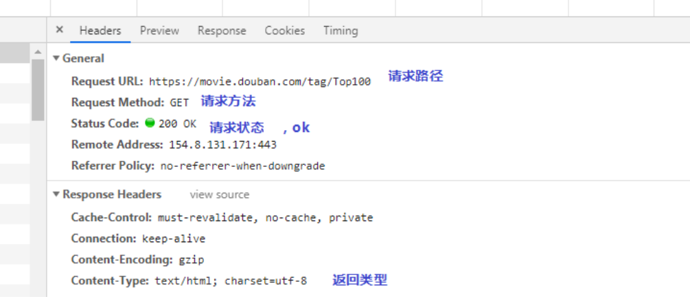
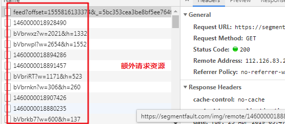

## ajxa 异步数据网站抓取
### ajxa 实战
- #### [思否社区](./segmentfault/)

### ajxa 简介
#### 有没有遇到过这种问题？明明在网页上能看到数据，但是请求之后并没有返回给自己想要的数据。这是为什么呢？
#### 其实，这就是ajax异步加载，利用ajax异步加载，还能提升页面响应速度。所以很多网站也会用异步加载，这个专题就是用来了解异步加载数据的抓取方式，分析方法的！

#### 首先我们看一下普通请求和ajax请求抓包上面的区别。    
例如：[豆瓣电影Top100](https://movie.douban.com/tag/Top100) -- [项目地址](../douban_movie/)  
网页打开的网址是: https://movie.douban.com/tag/Top100  
响应返回的请求头是:

**所以我们需要的数据直接请求浏览器打开的网址即可，但是对于有一些网址，直接请求浏览器访问的网址是拿不到数据的，其实浏览器访问一个网址，他也会顺带访问其他网址，如下图：**  
  
那么其实数据就在这些请求中。  

