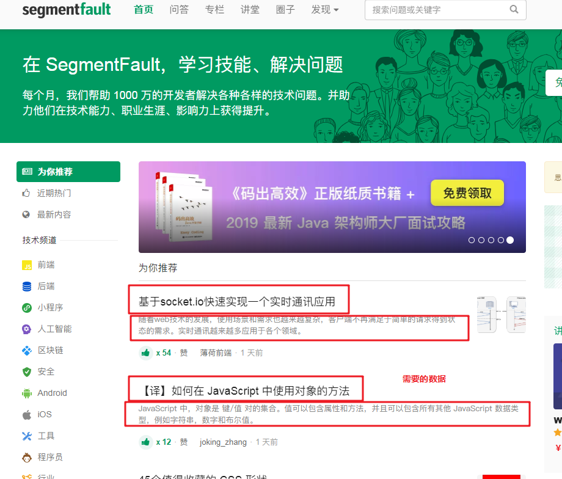
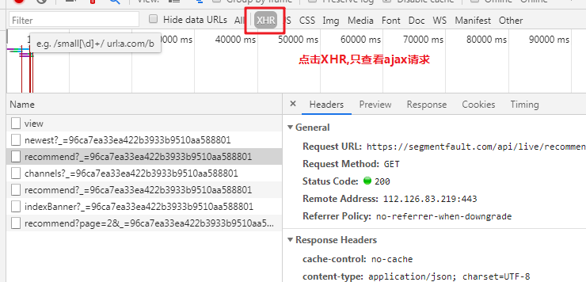
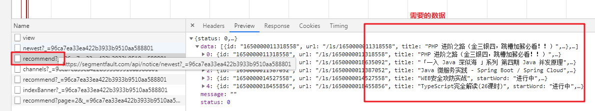
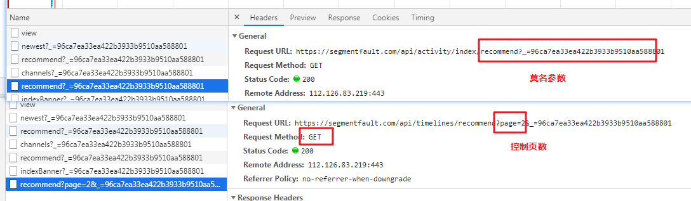

# segmentfault 社区异步抓取
https://segmentfault.com/

本项目主要是ajax分析练习抓取练习.话不多说，开始我们的抓取之旅吧！
### 1. [首页分析](#1-首页分析)  # 需要的数据请求地址分析

#### [完整代码 jupyter_notebook](./example.ipynb)

### 1. 首页分析。
   - #### 打开 [目标url](https://segmentfault.com/), 定位数据位置
        
   - #### 进行数据定位。  
        
      由图可得，我们第一页的数据应该是没问题的。但是第二页在哪里？我们往下看看。
### 2. ajax页面分析
   - #### 寻找下一页
      我们进行鼠标滚动操作，继续往下找。我们虽然不断的再滚动滚轮，但是数据却没有到达底部，还在源源不断的出来。那么很明显，这里有ajax请求！
      因为在首页的抓取中，我们根本没有发现这些数据。
        
   - #### 确认数据请求来源
        好东西，居然突然出现，那我们来抓包看看这些数据到底哪里来的？  
        PS：这里有个小技巧，我们可以只看ajax请求
          
        查看所有ajax请求（因为这里请求很少，我们就不用搜索了，直接查看即可）：
          
      上图可知，这个recommend接口就是能产生源源不断的数据！并且数据格式是json，那么处理也就更简单了！ 
   - #### 查看headers，分析请求报文
        
      我们看到该接口，有两个参数，`page`，和`_`,这个`page`肯定是控制推荐页数的，在第一页请求时没有携带，肯定对方服务器做了处理，第一页我们同样传`page=1`即可。后面这个`_`参数根据推荐系统来说，应该是个群体代号或者用户id，但是我并没有登录，那么目前传递的这个参数很可能是个通用的id。  
      分析结果如图，所以我们可以得出以下结论：  
        首页接口:

        | 信息     | 结果                                  |
        | :------- | -------------------------------------|
        | 请求地址 | <https://segmentfault.com/> |
        | 请求方法 | Get                                   |
        | 响应格式 | text 文本                             |
        | 编码     | UTF-8                                |
        | 参数     |None                        |


   推荐信息接口:  

   | 信息     | 结果                                  |
   | :------- | -------------------------------------|
   | 请求地址 | <https://segmentfault.com/api/timelines/recommend> |
   | 请求方法 | Get                                   |
   | 响应格式 | json                            |
   | 编码     | UTF-8                                |
   | 参数     |page, _                        |

## 2. 利用requests进行数据抓取
分析已经完成，那么写代码。当然是分分钟的事情啦！  
话不多说，直接开撸。


模块导入
```python
>>> import requests
>>> from requests.exceptions import HTTPError
```
#### 获取首页数据
    定义首页获取函数 `get_data`：

    def get_data(url):
    
        response = requests.get(url)
        if response.status_code == requests.codes.ok:  # 检测状态码
            return response.text  # 返回响应的文本信息
        else:
            response.raise_for_status()  # 4xx 5xx 时,引出错误 代替 raise requests.exception.HTTPError
    
    url = "https://segmentfault.com"
    data = get_data(url)  # 获取数据
    data_res = {}  # 存储数据的初始化字典
    data # 查看数据

输出结果如下：

    \n<!DOCTYPE HTML><html lang="zh-CN"><head><meta charset="UTF-8"/><meta http-equiv="X-UA-Compatible" content="IE=edge, chrome=1"/><meta name="renderer" content="webkit"/><meta property="qc:admins" content="15317273575564615446375"/><meta property="og:image" content="https://static.segmentfault.com/v-5c8b4d77/global/img/t
    ......

####  Scrapy 提取首页数据 
   - scrapy 混合提取，个人习惯，选用该提取方式
    

    >>> from scrapy import Selector
    >>> from urllib import parse  # 用于url合并的工具
        
初始化选择器
    

    >>> se = Selector(text=data)

用混合提取器提取数据
    
    
    

    >>> se = Selector(text=data)
提取比较简单，规则如下：
    


    items = se.css(".news__item-info.clearfix")
    for item in items:
        title = item.xpath(".//h4/text()").extract_first()  # 获取文章标题
        content = item.css(".article-excerpt::text").extract_first().strip()  # 获取文章描述
        content_url = item.xpath("./a/@href").extract_first()  # 获取文章url
        print(title)
        print(content)
        print(parse.urljoin(url,content_url))  # 合并url，形成完整的url
        print()

输出结果如下：  
(这里我们就不保存数据了，保存数据可以自行尝试。)

    基于socket.io快速实现一个实时通讯应用
    随着web技术的发展，使用场景和需求也越来越复杂，客户端不再满足于简单的请求得到状态的需求。实时通讯越来越多应用于各个领域。
    https://segmentfault.com/a/1190000018944634
    ......
#### requests 获取推荐数据


## 总结
以上就是我们该次提取练习的所有内容,以豆瓣电影top100的响应为例,我们讲解了常用的5种提取器.  
**1. 正则**  
   - "." 表示任意非空格换行等字符
   - ".*?"  表示贪婪匹配,最少匹配一次
   - "()"  表示提取()中的内容
   -  "\\w" 表示正常字符,比如英文字母,中文等常见文字
   - ".+"  表示至少匹配一次任意字符  


#### [完整代码](./douban_spider.ipynb)
